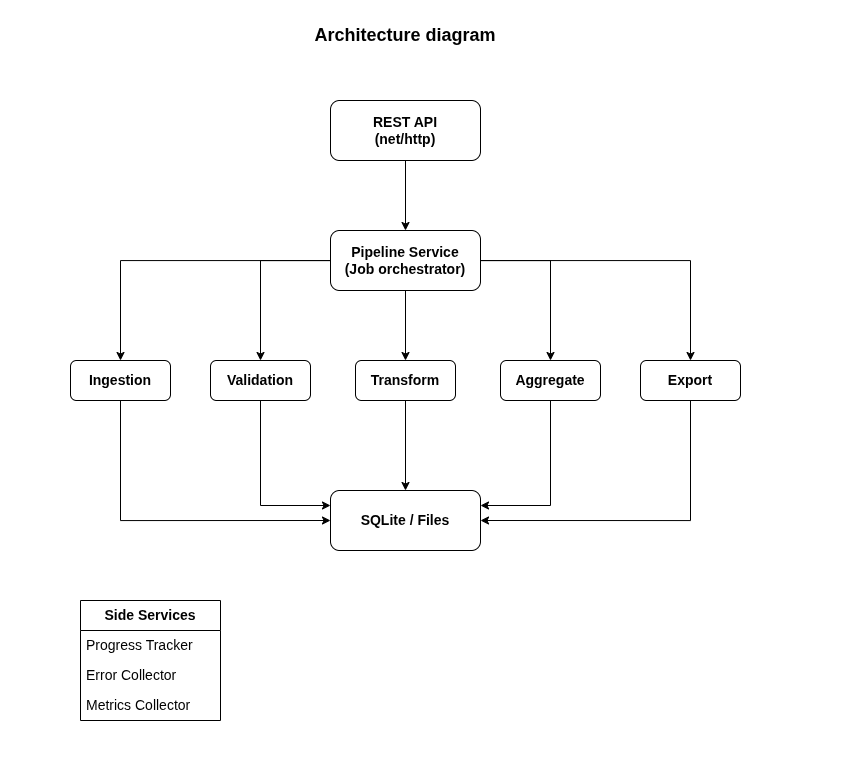

# Data Processing Pipeline

A Go project scaffold for a data processing pipeline with API entrypoints, ingestion, validation, transformation, aggregation, export, storage, and metrics layers.

## Architecture



## Project Structure

```text
data-processing-pipeline/
├── cmd/
│   └── server/
│       └── main.go
├── internal/
│   ├── api/
│   │   ├── handler.go
│   │   ├── router.go
│   │   └── middleware.go
│   ├── pipeline/
│   │   ├── pipeline.go
│   │   ├── worker_pool.go
│   │   ├── progress.go
│   │   ├── metrics.go
│   │   └── errors.go
│   ├── ingestion/
│   │   ├── csv.go
│   │   ├── json.go
│   │   └── api.go
│   ├── validation/
│   │   └── validator.go
│   ├── transformation/
│   │   └── transformer.go
│   ├── aggregation/
│   │   └── aggregator.go
│   ├── export/
│   │   ├── sqlite.go
│   │   ├── csv.go
│   │   └── json.go
│   ├── models/
│   │   ├── job.go
│   │   ├── record.go
│   │   └── metrics.go
│   └── storage/
│       └── sqlite.go
├── test/
│   ├── integration/
│   ├── unit/
│   └── testdata/
├── sample-data/
│   ├── input/
│   └── output/
├── go.mod
├── go.sum
└── README.md
```

## Components

- `cmd/server`: Application entrypoint for the HTTP server.
- `internal/api`: HTTP routing, handlers, and middleware.
- `internal/pipeline`: Pipeline orchestration, worker pool, progress, metrics, and errors.
- `internal/ingestion`: Input readers for CSV, JSON, and API sources.
- `internal/validation`: Record validation.
- `internal/transformation`: Record transformation.
- `internal/aggregation`: Data aggregation.
- `internal/export`: Exporters for SQLite, CSV, and JSON outputs.
- `internal/models`: Shared domain models.
- `internal/storage`: Storage adapters.
- `test`: Unit, integration, and test data folders.
- `sample-data`: Example input and output data folders.

## Getting Started

Run the server:

```bash
go run ./cmd/server
```

Check health:

```bash
curl http://localhost:8080/health
```

Run tests:

```bash
go test ./...
```
